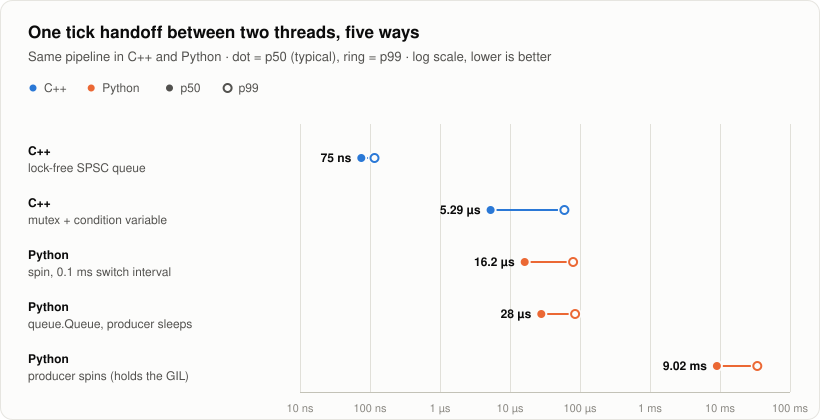
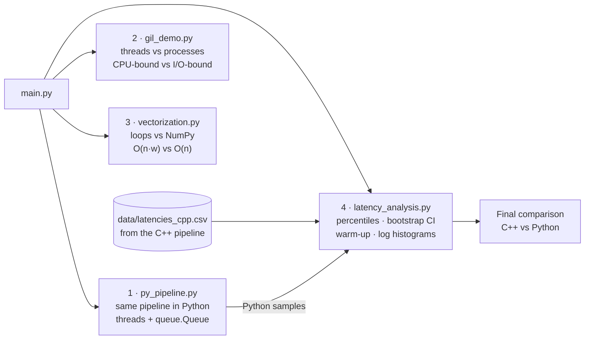
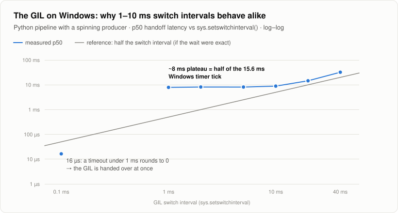
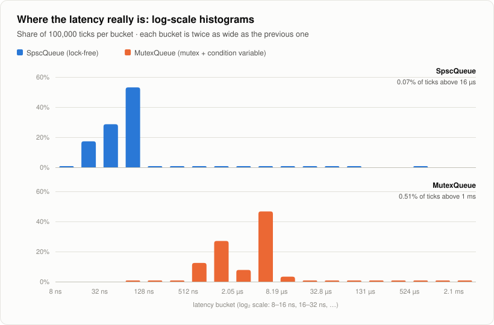

<div align="center">

# Python Performance, Concurrency & Latency Analysis

**The C++ tick pipeline rebuilt in Python: measure the GIL, make Python fast, and analyze latency like an engineer.**

[](https://github.com/AbdelkaderBelhadj-code/python-performance-concurrency/actions/workflows/ci.yml)


[](LICENSE)

<sub>Part of a 3-project series &nbsp;·&nbsp; <a href="https://github.com/AbdelkaderBelhadj-code/cpp-low-latency-pipeline">C++ Low-Latency Pipeline</a> &nbsp;·&nbsp; <a href="https://github.com/AbdelkaderBelhadj-code/python-probability-stats-lab">Probability &amp; Statistics Lab</a> &nbsp;·&nbsp; <b>Python Performance &amp; Concurrency</b></sub>

</div>

<br>

<p align="center">
  <picture>
    <source media="(prefers-color-scheme: dark)" srcset="docs/images/handoff-latency-dark.svg">
    
  </picture>
</p>

## At a glance

| Question | Measured answer |
|---|---|
| What does a Python thread-to-thread handoff cost? | **28 µs** at p50 (`queue.Queue`), 373× the C++ lock-free queue |
| What if the producer busy-waits, as the C++ one does? | **9 ms**: the spinning thread holds the GIL |
| Proof that the GIL is the cause? | Set the switch interval to 0.1 ms and it drops to **16 µs** |
| CPU-bound work: 4 threads vs 4 processes | **1.0×** vs **2.2×** faster |
| I/O-bound work: 4 threads | **4.0×** faster |
| NumPy vs a Python loop (volatility of 1 M prices) | **21×** faster |
| A better algorithm *plus* NumPy (moving average) | **110×** faster |

> [!NOTE]
> Measured on an Intel i5-10300H laptop (4 cores / 8 hyper-threads), Windows 11, Python 3.13.

**Contents:** [Why](#why-this-project) · [How it works](#how-it-works) · [Quick start](#quick-start) ·
[Results](#results) · [Key findings](#key-findings) · [Design Q&A](#design-qa) · [Ideas to extend](#ideas-to-extend)

---

## Why this project

The [C++ pipeline](https://github.com/AbdelkaderBelhadj-code/cpp-low-latency-pipeline) hands a tick between two threads
in 75 ns. What happens when you build the *same* thing in Python, and why? This repo answers it with controlled
experiments, then covers the two things Python is great at: fast numeric code with NumPy, and analysing measurement data
statistically (here, the C++ latency samples).

## How it works



| Module | What it does | Concepts it demonstrates |
|---|---|---|
| [`py_pipeline.py`](py_pipeline.py) | Producer thread → `queue.Queue` → consumer thread, with 3 ways of waiting | threads, the GIL, the switch interval, `perf_counter_ns`, `@dataclass(slots=True)` |
| [`gil_demo.py`](gil_demo.py) | The same jobs run sequentially, in 4 threads, and in 4 processes | the GIL, `ThreadPoolExecutor` vs `ProcessPoolExecutor`, process start-up cost |
| [`vectorization.py`](vectorization.py) | Volatility: loop vs comprehension vs NumPy. Moving average: O(n·w) vs O(n) vs NumPy | vectorization, memory layout, algorithmic complexity, best-of-N timing |
| [`latency_analysis.py`](latency_analysis.py) | Statistics on the latency samples: percentiles, bootstrap CI, warm-up, log histogram | nearest-rank percentiles, `np.partition`, the bootstrap |
| [`main.py`](main.py) | Command line: all demos, or one | `argparse`, the `__main__` guard (required for multiprocessing) |
| [`test_project.py`](test_project.py) | 7 tests: every fast version must match the simple one | testing optimized code |
| [`data/latencies_cpp.csv`](data/latencies_cpp.csv) | 200,000 latency samples measured by the C++ pipeline | reproducible analysis |

## Quick start

Requirements: Python 3.10+ and NumPy.

```bash
git clone https://github.com/AbdelkaderBelhadj-code/python-performance-concurrency.git
cd python-performance-concurrency
python -m pip install -r requirements.txt
python main.py                      # all 4 demos (~12 s)
python main.py gil                  # one demo: pipeline | gil | vectorize | analyze
python -m unittest -v               # 7 tests
```

To analyze a fresh run of the C++ pipeline instead of the bundled data:
`python main.py analyze --csv path/to/latencies.csv`.

## Results

### 1. The same pipeline in Python, and the GIL

```text
run                       mean       p50       p90       p99       max
Python sleep           33.1 us   28.0 us   52.8 us   85.1 us  331.4 us
Python spin           10.08 ms   9.02 ms  18.10 ms  34.12 ms  35.91 ms
Python spin 0.1ms      19.8 us   16.2 us   25.7 us   79.6 us  192.7 us
```

- **sleep:** each handoff wakes a sleeping thread, re-acquires the GIL and runs interpreted code, so 28 µs.
- **spin:** the producer busy-waits like the C++ one, but a spinning Python thread **never releases the GIL**. The
  consumer only runs when the interpreter forces a switch, and latency jumps to milliseconds.
- **spin with a 0.1 ms switch interval:** changing *only* the switch interval collapses latency to 16 µs. That's the
  controlled experiment that proves the GIL, not the queue, was the bottleneck.

<p align="center">
  <picture>
    <source media="(prefers-color-scheme: dark)" srcset="docs/images/gil-switch-interval-dark.svg">
    
  </picture>
</p>

On Windows, switch intervals from 1 to 10 ms all give a p50 of about **8 ms**. The interpreter's timed wait for the GIL
is rounded up to the OS timer tick (15.6 ms), and 8 ms is half a tick on average. A timeout under 1 ms rounds down to 0,
so the handoff is immediate.

### 2. Threads vs processes

| Workload (4 jobs) | Sequential | 4 threads | 4 processes |
|---|---|---|---|
| **CPU-bound** (pure Python loop) | 2.02 s | 1.94 s (**1.0×**) | 0.92 s (**2.2×**) |
| **I/O-bound** (waiting 0.25 s) | 1.00 s | 0.25 s (**4.0×**) | 0.54 s (1.9×) |

Threads can't speed up CPU-bound Python (one GIL), but they're ideal for waiting (the GIL is released during I/O).
Processes run in parallel, but on Windows each worker must start a new interpreter and re-import the modules
(about 0.4 s here), which is why the speed-up is 2.2× and not 4×.

### 3. Optimization: vectorization vs a better algorithm

| Volatility of 1,000,000 prices | Time | Speed-up |
|---|---|---|
| Python for-loop | 249 ms | 1.0× |
| Comprehension + `sum()` | 240 ms | 1.0× (idiomatic isn't automatically faster) |
| **NumPy** (vectorized) | **11.9 ms** | **21×** |

| Moving average, window 100, 200,000 prices | Time | Speed-up |
|---|---|---|
| Naive O(n·w) Python | 198 ms | 1.0× |
| Running sum O(n) Python | 21.7 ms | 9.2× (a better algorithm) |
| **Cumulative sum O(n) NumPy** | **1.8 ms** | **110×** (both combined) |

Memory for 1 million floats: a Python list takes **32 MB** (a pointer plus a boxed object per value), a NumPy array **8 MB**.

### 4. Latency statistics on the C++ data

<p align="center">
  <picture>
    <source media="(prefers-color-scheme: dark)" srcset="docs/images/latency-histograms-dark.svg">
    
  </picture>
</p>

```text
Final comparison (x = p50 relative to C++ SpscQueue)
  C++ SpscQueue          p50     75 ns   p99    116 ns          1x
  C++ MutexQueue         p50    5.3 us   p99   59.9 us         71x
  Python spin 0.1ms      p50   16.2 us   p99   79.6 us        216x
  Python sleep           p50   28.0 us   p99   85.1 us        373x
  Python spin            p50   9.02 ms   p99  34.12 ms    120,289x
```

- **The percentiles match the C++ program exactly**, because both use the same nearest-rank definition *and formula*.
- **Bootstrap:** the SPSC queue's p99 is 116 ns, 95% CI [115, 117] ns. With 100,000 samples even the p99 is precise, but
  the p99.9 rests on only about 100 samples.
- **Log-scale buckets reveal what the mean hides:** the mutex queue has *two* peaks, and its mean (17.5 µs) describes
  neither of them.

## Key findings

> [!IMPORTANT]
> **A floating-point gotcha in percentiles.** `np.percentile(x, 99.9, method="inverted_cdf")` uses the same nearest-rank
> definition as my code, yet returned a different p99.9. It computes `99.9 / 100 = 0.9990000000000001` first, so the
> rank becomes 99,901 instead of 99,900 for 100,000 samples. At exact boundaries, the *order* of floating-point
> operations decides the answer, so implementations that must agree should share one formula.

- **The GIL hides races instead of preventing them.** On Python 3.13 a bare unlocked `counter += 1` gave the right total
  5 times out of 5, because CPython only switches threads at certain points. One function call between the read and the
  write lost about 75% of the updates.
- **Warm-up is visible in the data.** The C++ SPSC queue's first 1,000 ticks had a p50 of 37 ns vs 76 ns afterwards.
  That's consistent with the threads starting on sibling hyper-threads and one later moving to another core (the
  [C++ repo's pinned benchmark](https://github.com/AbdelkaderBelhadj-code/cpp-low-latency-pipeline) measured 5.6 vs 35 ns per item).
- **Measure, then explain.** The comprehension wasn't faster, the processes weren't 4× faster, and the switch interval
  behaved differently on Windows than on paper. Each surprise came with a measurable reason.

## Design Q&A

[**docs/DESIGN_QA.md**](docs/DESIGN_QA.md) has 117 questions with short answers: this project's results, Python
concurrency (GIL, threads, processes, asyncio), language fundamentals, NumPy and pandas, profiling, and latency
statistics. A few examples:

- *Does the GIL make my code thread-safe?*
- *When should you use threads, processes, or asyncio?*
- *Can you average p99s from several servers?*
- *Why is `if __name__ == "__main__":` required here?*
- *Why a log-scale histogram for latency?*

## Ideas to extend

- [ ] An `asyncio` version of the I/O-bound demo (thousands of concurrent waits on one thread)
- [ ] Numba (`@njit`) or Cython for the loops, and the free-threaded Python build (no GIL) for the pipeline
- [ ] `multiprocessing.shared_memory` to share NumPy arrays between processes without copying
- [ ] A pandas / polars version of the analysis

## The series

| Project | Question it answers |
|---|---|
| [C++ Low-Latency Pipeline](https://github.com/AbdelkaderBelhadj-code/cpp-low-latency-pipeline) | How fast can two threads exchange data, and how do you measure it honestly? |
| [Probability & Statistics Lab](https://github.com/AbdelkaderBelhadj-code/python-probability-stats-lab) | Do I really understand the math? Every formula is checked against a simulation |
| **Python Performance & Concurrency** (this repo) | What changes in Python (the GIL), and what does the C++ latency data say statistically? |

## License

[MIT](LICENSE) © 2026 Belhadj Abdelkader
